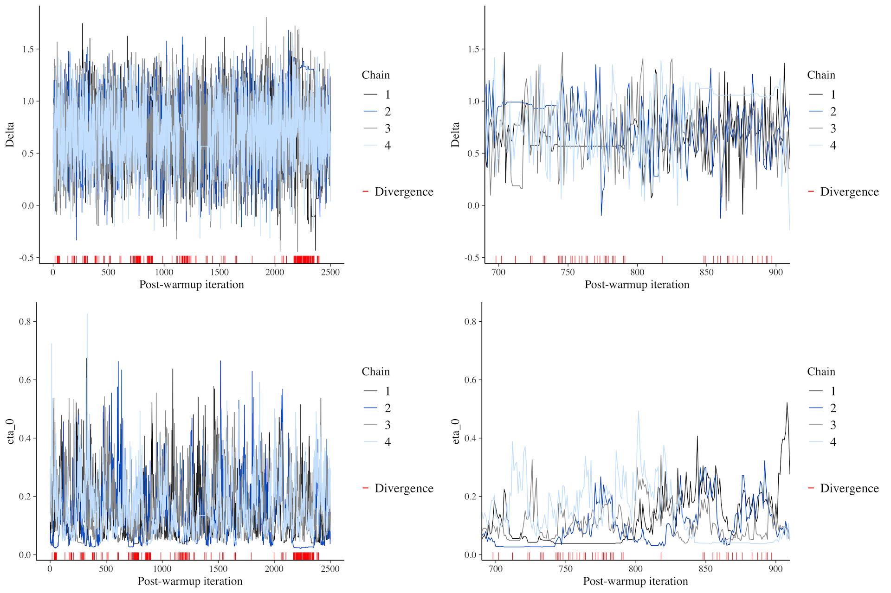

```{r setup, include=FALSE}
knitr::opts_chunk$set(
  echo = TRUE, out.height = "400px", dpi = 300,
  fig.align = "center", fig.width = 7, fig.height = 5
)
knitr::opts_knit$set(root.dir = here::here())

library(tidyverse)
theme_set(theme_minimal())

library(xaringanExtra)
use_xaringan_extra(c("panelset", "tachyons", "freezeframe"))

library(lme4)
library(ggeffects)
library(brms)
library(cmdstanr)
library(tidybayes)
library(bayesplot)

options(htmltools.dir.version = FALSE)
```

```{r xaringan-themer, include=FALSE, warning=FALSE}
library(xaringanthemer)
style_mono_accent(
  base_color = "#1c5253",
  header_font_google = google_font("Josefin Sans"),
  text_font_google   = google_font("Montserrat", "300", "300i", "700", "700i"),
  code_font_google   = google_font("Fira Mono"),
  outfile = "./slides/xaringan-themer.css"
)
```

```{r mald, echo=FALSE}
mald <- readRDS("./data/mald.rds")
```

## Plan

<br>

| Time          | Topic                                          |
|---------------|------------------------------------------------|
| 09.00 - 10.30 | **Introduction to Bayesian Linear Models**     |
| 10.30 - 11.00 | Break                                          |
| 11.00 - 12.30 | **Diagnostics, interactions, group-level effects** |
| 12.30 - 14.30 | Lunch + Posters                                |
| 14.30 - 16.00 | **Priors**                                     |
| 16.00 - 16.30 | Break                                          |
| 16.30 - 18.00 | Q&A/Consultations                              |

<br>

NOTE: Please, re-download the Starter Kit.

---

class: right


<br>
<br>
<br>
<br>


.f2[
One **model** to rule them all.<br>
One **model** to find them.<br>
One **model** to bring them all<br>
And in the darkness bind them.
]

--

.f5[(No, I couldn't translate 'model' into Black Speech, alas...)]

---

class: center middle

.f2[Now enter The Linear Model]

<iframe src="https://giphy.com/embed/l4FGCymGGNTZVZwtO" width="480" height="200" frameBorder="0" class="giphy-embed" allowFullScreen></iframe><p>

---

class: center middle

.f2[Now enter The Bayesian Linear Model]

<iframe src="https://giphy.com/embed/3ov9jG4eqz9k3XXsU8" width="480" height="480" frameBorder="0" class="giphy-embed" allowFullScreen></iframe><p>

---

# All about the Bayes

.bg-washed-blue.b--dark-blue.ba.bw2.br3.shadow-5.ph4.mt5[

Within the **NHST (Frequentist) framework**, the main analysis output is:

- **Point estimates** of predictors' parameters (with standard error).
- **P-values**. 😈

]

--

.bg-washed-yellow.b--gold.ba.bw2.br3.shadow-5.ph4.mt5[

Within the **Bayesian framework**, the main analysis output is:

- **Probability distributions** of predictors' parameters.

]

---

# An example

[Massive Auditory Lexical Decision](https://aphl.artsrn.ualberta.ca/?page_id=827) (Tucker et al. 2019):

- **MALD data set**: 521 subjects, RTs and accuracy.

- Subset of MALD: 30 subjects, 100 observations each.

- Let's investigate the effect of *mean phone-level Levenshtein distance* and *lexical status* (word vs non-word).

--

```{r mald-print}
mald
```


---

layout: true

# A frequentist linear model

---

```{r lm-1}
lm_1 <- lmer(
  RT ~
    PhonLev +
    IsWord +
    PhonLev:IsWord +
    (1 | Subject),
  data = mald
)
```

---

```{r lm-1-sum, echo=FALSE}
summary(lm_1, correlation= FALSE)
```

---

```{r lm-1-pred, echo=FALSE, message=FALSE}
ggpredict(lm_1, terms = c("PhonLev", "IsWord")) %>%
  plot()
```

---

layout: false

# Increase model complexity

**Try it yourself!** Does it work?

```{r lm-2, eval=FALSE}
lm_2 <- lmer(
  RT ~
    PhonLev +
    IsWord +
    PhonLev:IsWord +
    (PhonLev + IsWord | Subject),
  data = mald
)
```

--

```{r lm-2-run, echo=FALSE}
lm_2 <- lmer(
  RT ~
    PhonLev +
    IsWord +
    PhonLev:IsWord +
    (PhonLev + IsWord | Subject),
  data = mald
)
```

.center[
<iframe src="https://giphy.com/embed/3o7abwbzKeaRksvVaE" width="480" height="204" frameBorder="0" class="giphy-embed" allowFullScreen></iframe>
]

---

class: center middle inverse

.f1[Let's go Bayesian!]

---

layout: true

# A Bayesian linear model

---

```{r brm-1, eval=FALSE}
brm_1 <- brm(
  RT ~
    PhonLev +
    IsWord +
    PhonLev:IsWord +
    (PhonLev + IsWord | Subject),
  data = mald,
  family = gaussian()
)
```

```{r brm-1-run, echo=FALSE}
brm_1 <- brm(
  RT ~
    PhonLev +
    IsWord +
    PhonLev:IsWord +
    (PhonLev + IsWord | Subject),
  data = mald,
  family = gaussian(),
  # Technical stuff
  backend = "cmdstanr",
  cores = 4,
  threads = threading(2),
  file = "data/cache/brm_1"
)
```

---

.medium[
```{r brm-1-sum, echo=FALSE, warning=FALSE}
brm_1
```
]

---

```{r brm-1-cond, echo=FALSE, out.height="500px"}
conditional_effects(brm_1, effects = "PhonLev:IsWord")
```

---

layout: false

# Let's start small

**Try it yourself!**

```{r brm-2}
brm_2 <- brm(
  RT ~
    IsWord,
  data = mald,
  family = gaussian(),
  # Use cmdstanr
  backend = "cmdstanr",
  # Save model output to file
  file = "./data/cache/brm_2.rds"
)
```

--

<br>

- The model has to estimate the probability distributions of the estimates.

- To do so, a **sampling algorithm** is used (Markov Chain Monte Carlo, **MCMC**).

---

class: center middle reverse

.f1[[MCMC what?](https://chi-feng.github.io/mcmc-demo/app.html)]

**Markov Chain Monte Carlo**

More on MCMC: <http://elevanth.org/blog/2017/11/28/build-a-better-markov-chain/>

---

layout: true

# Let's start small

---

.pull-left[
```{r brm-2-explain, eval=FALSE}
brm_2 <- brm(
  RT ~ IsWord,
  data = mald,
  
  # Probability distribution
  # of the OUTCOME
  family = gaussian(),
  
  # TECHNICAL STUFF
  # Use cmdstanr
  backend = "cmdstanr"
  # Save model output to file
  file = "./data/cache/brm_2.rds",
  # Number of chains
  chains = 4, 
  # Number of iterations per chain
  iter = 2000,
  # Number of cores to use
  cores = 4
)
```
]

--

.pull-right[
- `formula`, `data` and `family` should be familiar.

- `chains`: Number of MCMC chains to be run.

- `iter`: Number of iterations per MCMC chain.

- `cores`: Number of cores to use for running the MCMC chains.

  - You can find out how many cores your laptop has with `parallel::detectCores()`
]

---

How do I interpret the output summary?

.big[
```{r brm-2-sum}
summary(brm_2)
```
]

---

```{r brm-2-sum-2, echo=FALSE}
cat(capture.output(summary(brm_2))[8:11], sep = "\n")
```

* `Intercept`: There is a **95% probability** that (based on model and data) the mean RT when the word is real is **between 964 and 999 ms**.

  * The probability distribution of the intercept has mean = 981 ms and SD = 8.84.

--

* `IsWordFALSE`: At **95% confidence**, the difference in RT between non-words and real words is **between 109 and 158 ms** (based on model and data).

  * The probability distribution of `IsWordFALSE` has mean = 133 ms and SD = 12.63 ms.

--

.bg-washed-yellow.b--gold.ba.bw2.br3.shadow-5.ph4[

* These are **posterior probability distributions**.
* They are always conditional on model and data.
* The summary reports **95% Credible Intervals**, but you can get other intervals too (there is nothing special about 95%).

]

---

layout: false

# Quick plot

```{r brm-2-plot}
plot(brm_2)
```

---

# Get MCMC draws

You can easily extract the MCMC draws:

```{r brm-2-draws}
brm_2_draws <- as_draws_df(brm_2)
brm_2_draws
```

---

# Get parameters (variables)

To list all the names of the parameters in a model, use:

```{r brm-2-vars}
variables(brm_2)
```

---

layout: true

# Posterior distributions

---

Now you can plot the draws using ggplot2.

```{r brm-2-int-g}
g_1 <- brm_2_draws %>%
  ggplot(aes(b_Intercept)) +
  stat_halfeye(fill = "#214d65", alpha = 0.8) +
  scale_x_continuous() +
  labs(title = "Posterior distribution of Intercept")
```

---

```{r brm-2-int, echo=FALSE}
g_1
```


---

```{r brm-2-isword-g}
g_2 <- brm_2_draws %>%
  ggplot(aes(b_IsWordFALSE)) +
  stat_halfeye(fill = "#624B27", alpha = 0.8) +
  scale_x_continuous() +
  labs(title = "Posterior distribution of IsWord: FALSE - TRUE")
```

---

```{r brm-2-isword, echo=FALSE}
g_2
```

---

layout: false
class: center middle inverse

.f1[DIAGNOSTICS]

---

layout: true

# MCMC chains diagnostics

---

```{r brm-2-chain-1, message=FALSE}
as.array(brm_2) %>%
  mcmc_trace("b_Intercept", np = nuts_params(brm_2))
```

---

```{r brm-2-chain-2, message=FALSE}
as.array(brm_2) %>%
  mcmc_trace("b_IsWordFALSE", np = nuts_params(brm_2))
```

---

An example of bad MCMC chain mixing.

.center[

]

???

Picture from <https://www.rdatagen.net/post/diagnosing-and-dealing-with-estimation-issues-in-the-bayesian-meta-analysis/>.

---

** $\hat{R}$ and Effective Sample Size**

.medium[
```{r brm-2-diag}
brm_2
```
]

---

layout: false

# Posterior predictive checks

```{r brm-2-pp}
pp_check(brm_2, ndraws = 100)
```

---

class: center middle inverse

.f1[Level up!]

---

layout: true

# Interactions and group-level effects

---

```{r brm-1-bis}
brm_1_bis <- brm(
  RT ~
    PhonLev +
    IsWord +
    # Interaction
    PhonLev:IsWord +
    # Group-level effects
    (PhonLev + IsWord | Subject),
  data = mald,
  family = gaussian(),
  # Technical stuff
  backend = "cmdstanr",
  cores = 4,
  threads = threading(2),
  file = "data/cache/brm_1_bis"
)
```

---

.medium[
```{r brm-1-bis-sum, echo=FALSE, warning=FALSE}
brm_1_bis
```
]

---

layout: false
layout: true

# Interactions

---

```{r brm-1-bis-cond}
conditional_effects(brm_1_bis, effects = "PhonLev:IsWord")
```

---

```{r brm-1-bis-sum-2, warning=FALSE, echo=FALSE}
cat(capture.output(summary(brm_1_bis))[25:30], sep = "\n")
```

* `Intercept`: At 95% confidence, the mean RT when the word is real and the mean phone-level distance is 0 is between 661 and 849 ms.

* `PhonLev`: At 95% probability, the difference in mean RT for each unit-increase of phone-level distance, when the word is real, is between 20 and 45 ms.

* `IsWordFALSE`: There is a 95% probability that the difference in mean RT between non-words and real words, when mean phone-level distance is 0, is between 79 and 342 ms.

* `PhonLev:IsWordFALSE`: We can be 95% confident that for each unit-increase of mean phone-level distance when the word is not a real word the difference in mean RT changes by -29 to +7 ms (relative to the difference when the word is real).

---

```{r brm-1-bis-cond-2, eval=FALSE}
conditional_effects(
  brm_1_bis, effects = "PhonLev:IsWord",
  spaghetti = TRUE, ndraws = 200
) %>%
  plot(spaghetti_args = list(linewidth = 2))
```

---

```{r brm-1-bis-cond-3, echo=FALSE, out.height="500px", cache=TRUE}
conditional_effects(
  brm_1_bis, effects = "PhonLev:IsWord",
  spaghetti = TRUE, ndraws = 200
) %>%
  plot(spaghetti_args = list(linewidth = 2))
```

---

layout: false
layout: true

# Group-level effects

---

**Group-level effects** are the Bayesian equivalent of frequentist random effects.

```{r brm-1-bis-sum-3, warning=FALSE, echo=FALSE}
cat(capture.output(summary(brm_1_bis))[8:16], sep = "\n")
```

--

.bg-washed-yellow.b--gold.ba.bw2.br3.shadow-5.ph4.mt5[

As with the population-level effects, the interpretation of the group-level effects is the same as that of the frequentist random effects, but you have a full (posterior) probability distribution instead of a point estimate.

]

---

```{r shrunk, echo=FALSE}
brm_1_shrunk <- brm_1_bis %>%
  spread_draws(b_IsWordFALSE, b_PhonLev, r_Subject[Subject,term]) %>%
  mean_qi() %>%
  mutate(source = "meta-analysis")

gmean_RT <- mean(mald$RT, na.rm = TRUE)

original <- mald %>%
  group_by(Subject) %>%
  summarise(
    mean_RT = mean(RT) ,
    sd_RT = sd(RT),
    lower = mean_RT - 1.96 * sd_RT,
    upper = mean_RT + 1.96 * sd_RT
  )
```

```{r brm-1-shrunk-intercept, echo=FALSE, out.height="500px"}
brm_1_shrunk %>%
  filter(term == "Intercept") %>%
  ggplot(aes(r_Subject, reorder(as.character(Subject), r_Subject))) +
  geom_vline(xintercept = 0, linetype = "dashed") +
  geom_point(size = 4) +
  geom_errorbarh(aes(xmin = r_Subject.lower, xmax = r_Subject.upper)) +
  geom_point(data = original, aes(mean_RT - gmean_RT, Subject), colour = "red", size = 3, alpha = 0.6) +
  labs(
    title = "By-subject conditional mode for Intercept",
    x = "Conditional mode",
    y = "Subject",
    caption = str_wrap("The red dots mark the by-subject mean RT from the raw data.")
  )
```

---

```{r brm-1-shrunk-isword, echo=FALSE, out.height="500px"}
brm_1_shrunk %>%
  filter(term == "IsWordFALSE") %>%
  ggplot(aes(r_Subject, reorder(as.character(Subject), r_Subject))) +
  geom_vline(xintercept = 0, linetype = "dashed") +
  geom_point(size = 4) +
  geom_errorbarh(aes(xmin = r_Subject.lower, xmax = r_Subject.upper)) +
  labs(
    title = "By-subject conditional mode for IsWord = FALSE",
    x = "Conditional mode",
    y = "Subject"
  )
```

---

```{r brm-1-shrunk-cor, echo=FALSE, out.height="500px"}
as_draws_df(brm_1_bis) %>%
  ggplot(aes(sd_Subject__Intercept, sd_Subject__IsWordFALSE)) +
  geom_point(size = 1, alpha = 0.2) +
  labs(
    title = "Group-level Intercept vs IsWordFALSE"
  )
```

---

layout: false

# We didn't talk about priors, no no no...

.center[

]

---

class: middle center inverse

.f1[QUESTIONS?]
